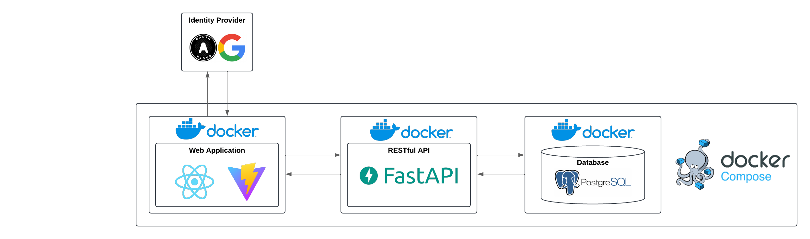
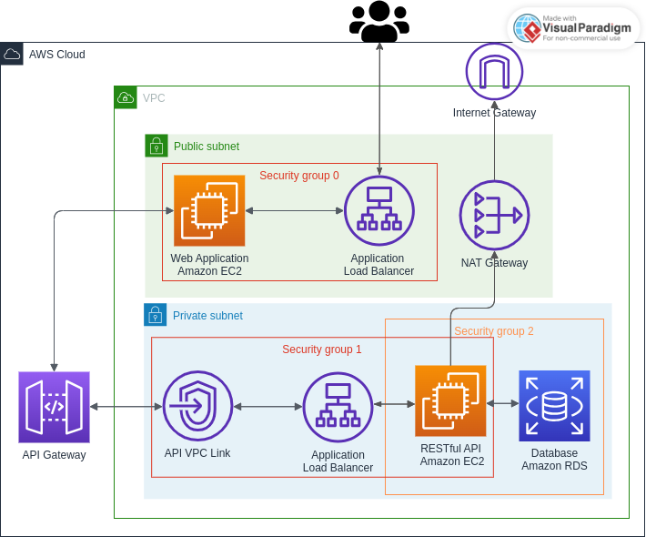

# Individual Assignment for the Software Engineer class

## Introduction

This individual project proposal outlines the scope and objectives of a software development project to be undertaken by each student. The goal of this project is to enable students to gain practical experience in designing, developing, and deploying a software solution on Amazon Web Services (AWS).
The main idea of the solution to be implemented is to create a To-Do List Application that follows this functionalities:

- Each user must authenticate in the system;
- The tasks created by a user can only be visible to them;
- Users should be able to add tasks with a title and description;
- Users can mark tasks as completed;
- Users can edit or delete existing tasks;
- Users can set deadlines for tasks;
- Provide options to sort tasks by creation date, deadline, or completion status;
- Allow filtering tasks by category or completion status;
- Users should be able to assign priorities (like low, medium, high) to tasks;

## Objectives 

- Software Development: Develop a web-based software solution hosted on AWS that includes a RESTful API, a Web UI, and interacts with a relational database.
- Agile Workflow: Implement an agile development methodology with epics and user stories to manage project tasks efficiently and promote iterative development.
- Authentication and Authorization: Implement authentication, authorization, and accounting (AAA) mechanisms using, for instance, AWS Cognito for user management. Students should use an IDP.
- Secure and Robust Deployment: The developed solution must be deployed on AWS in a secure and robust approach.

## Main Architecture



## Deployment Architecture



## Links with deployment solution

#### RESTful API:
[https://f9xqys4fz4.execute-api.us-east-1.amazonaws.com](https://f9xqys4fz4.execute-api.us-east-1.amazonaws.com)

#### Web Application:
[https://es-ua.ddns.net](https://es-ua.ddns.net)
> This link might not work, to make it work follow this steps
> - Update the file ```/etc/hosts``` with this lines:
> ```bash
> 34.239.221.173  es-ua.ddns.net
> 3.214.239.3     es-ua.ddns.net
>```

You can also use this link but it will say thats insecure, to bypass this just click on advance details and proceed <br />

[https://taskflow-frontend-load-balancer-506252942.us-east-1.elb.amazonaws.com](https://taskflow-frontend-load-balancer-506252942.us-east-1.elb.amazonaws.com)

### Grade: 18.1