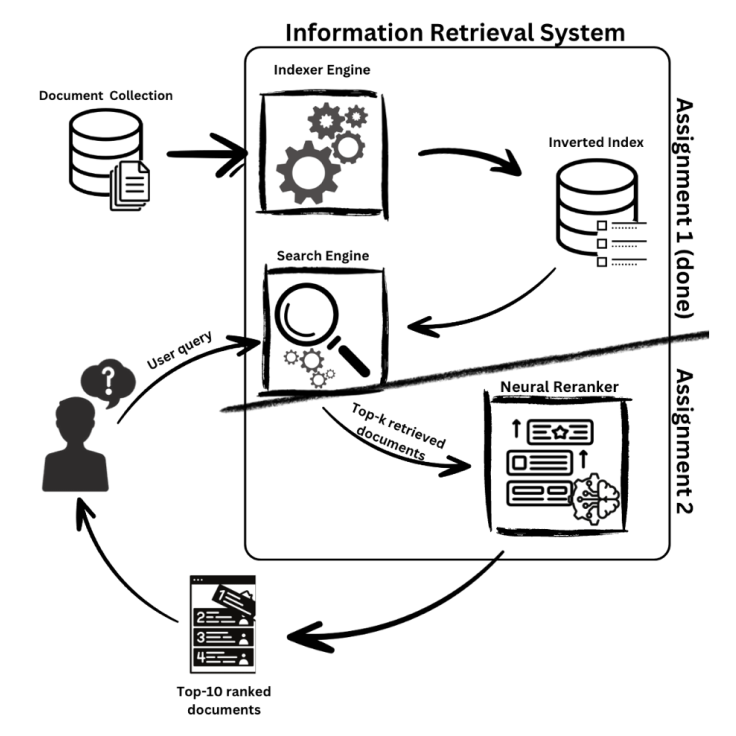

# Information Retrieval 2nd Assignment

## Introduction

The assignment consisted in enhance our information retrieval system by implementing a Neural Reranker module. This component aims to improve the ranking quality of search results obtained from our previously implemented BM25 searcher. Through this assignment, you'll gain practical experience with neural approaches to document ranking, an important mechanism in modern information retrieval systems.



### Grade: 15.7

## Solution developed

The solution that we developed is divided in five main parts:
- __Corpus Reader__
- __Relevance Evaluator__
- __Neural Reranker__
- __Training Dataset__
- __Training Model__

### Corpus Reader

The corpus reader is responsible for reading the documents from the corpus and returning them in a format that can be used by the different components in the solution. It has 3 main methods:

- __load_documents:__ Read the documents that are in the ,`MEDLINE_2024_Baseline.jsonl`. It returns a dictionary containing the following structure:

```json
{
    "<doc_id>": "<document_text>",
    "<doc_id>": "<document_text>",
    "<doc_id>": "<document_text>",
    ...
}
```

- __load_training_data:__ Read the training data provided by the class professors, to train the choosen model. It returns a list of dictionaries with the following structure:

```json
[
    {
        "question": "<question_text>",
        "goldstandard_documents": ["<document_id>", "<document_id>", "<document_id>", ...],
        "query_id": "<query_id>"
    }    
]
```

- __load_training_data_bm25:__ Read the training data ranked by the bm25 algorithm provided by the class professors

```json
[
    {
    "query_id": "<query_id>",
    "retrieved_documents": [
        {
            "id": "<document_id>",
            "score": "<bm25_score>"
        },
        ...
    ],
    ...    
]
```

### Relevance Evaluator

The relevance evaluator is responsible for evaluating the relevance of the documents returned by the BM25 algorithm. It uses the nDCG@10 metric to evaluate the relevance of the documents. We used the relevance evaluator created in the first assignment to evaluate our neural reranker.

### Train Dataset

We developed a class to create a training dataset to train our model. The training dataset is created using the training data provided by the class professors, and the documents returned by the BM25 algorithm, also provided by the professors, to have a sampling of positive and negative examples according to the **Static Hard Approach**

> Find documents that are similar but irrelevant to the query. For instance, consider the documents retrieved from BM25 as negative (Positive in VM25 that are not in the gold standard ones)

We tried multiple variations of the negative and positive sampling, like:
- The first approach that we decided to implement was the **Fully Random Approach** where we defined a max number of documents and questions to be used in the training dataset and the algorithm would first store the __goldstandard documents__ and then randomly select the same number of documents that were not in the __goldstandard documents__. 

- The second approach that we decided to implement was the **Static Hard Approach**, including all the goldstandard documents and all the other ones that the bm25 algorithm returned and were not in the goldstandard ones.

- Our final and current approach is also based in the **Static Hard Approach** but we decided to instead of include all the documents that the bm25 algorithm returned and were not in the goldstandard ones, we decided to create a ratio approach, where for one positive document we would include 4 negative documents.

### Trainer

The trainer is responsible for training the model using the training dataset created by the Train Dataset class. It receives the following parameters:
- __model:__ An instance of the model we want to train
- __train_dataset:__ The dataset containing training examples
- __batch_size:__ The number of samples per batch during training (the default is 32)
- __lr:__ learning rate for the optimizer (default: 2 * (10^-5))
- __epochs:__ The number of epochs to train the model (default: 3)
- __adam_epsilon:__ A small constant added to the optimizer for numerical stability (default: 1e-8)

It has the following workflow:

- *Initialization*:
    - Prepare the model, by moving it to the aproppriate device (GPU if it is available else CPU)
    - A **Pytorch Dataloader** is set up using the provided training dataset
    - An instance of the `collate_fn` is created that handles variable-length sequences by padding them
    - The optimizer is initialized using the **Adam** with the specified learning rate and epsilon value
    - A variable to store the best loss from each epoch is initialized to infinity, allowing the trainer to track and save the best model during training

- *Training Loop*:
    - The model is trained for the specified number of epochs
    - For each batch "feed" to the model
        - The data is moved to the appropriate device
        - Gradients are zeroed
        - The forward pass is executed, computing the model's loss
        - Backpropagation is performed
        - The optimizer updates the model weights
    - The average loss for the epoch is computed by summing the batche losses and diving by the number of batches
    - If the average loss improves, the model is saved to disk in the file `best_model.pth`

The `Trainer` class contains a method called `build_collate_fn` that ensures the data is properly formatted and padded for training, where, variable-length sequences are padded to the same length within a batch using the `pad_sequence` function from PyTorch. The **Labels** are converted to long tensors.

### Reranker

The reranker is responsible for reranking the documents returned by the BM25 algorithm. It uses the trained model to rerank the documents. It has 3 main blocks:

- The initialization block, initializes the `Reranker` class with a pretrained model, tokenizer, a dictionary containing all the documents, the path to the model weights (the result of the training) and an `nDCGCalculator` instance for evaluation (mentioned above). It sets up the device for the model execution, just like the trainer. It also loads the saved model weights tusing PyTorch and prepares the model for eavluation by switching to evaluation mode.

- The rerank block processes search results by scoring and re-ranking documents for each query. In each of the queries, it tokenizes and the query and associated documents, feeding the resulting tensors into the model to generate relevance scores. These scores are used to sort the documents in descending order of relevance. The top 10 most relevant documents for each queryare saved to an output **JSONL** file.

- The evaluation block calculates the effectiveness of the reranker using the nDCG metric. It reads the re-ranked results from the output file and maps queries to their top-ranked_documents. The method then calls the `nDCGCalculator` to compute the average nDCG@10 score for the reranked results, comparing them against the provided goldstandard documents for each question. Finally, it ouputs the nDCG score, providing a quantitative assessment of the reranker's performance.

### Models used

In our implementation we used 3 different models, one developed by us with an interaction based architecture, called `CNNInteractionBasedModel`, and two pre-trained models, the `Bert Model` for sequence classification and another one BERT-based tailored for biomedical natural language processing tasks called `microsoft/BiomedNLP-BiomedBERT-base-uncased-abstract-fulltext`. We decided to use 3 different models to see which one would perform better in our task.

The `CNNInteractionBasedModel` first converts query and document IDs into dense vector embeddings using an embedding layer, which maps each token to a 300-dimensional vector with constraints such as the maximum norm of 1. It then calculates an interaction matrix by performing a batched matrix multiplications of the query and document embeddings, representing the pairwise similarity between the tokens in the query and document. This matrix is reshaped to include a channel dimension and passed through a convolutional layer, which learns spatiall patterns in the interaction data using a 3x3 kernl and produces 100 feature maps. The output of the convolution is activated using the `ReLU` function and then downsampled using max pooling to extract the most salient features accross the interaction space. The resulting pooled featuers are flattened and passed through a fully connected layer to produce a single logit, which is converted into a probability score using a sigmoid activation function. This probability score represents the predicted relevance of the document to the query.

The `Bert Model` works by leveraging its deep bidirectional transformer architecture to understand the semantic relationship between a query and a document. Given a query and a document as inout, BERT concatenates them into a single sequence with special tokens (`[CLS]` at the beginning and `[SEP]` between the query and document) and processes the sequence through multiple transformer layers. These layers model complex dependencies between the words in both the query and document, capturing contextualized representations of their meanings. THe `[CLS]` token's final embedding is treated as a summary representation of the query-document pairm which is then passed through a classification head (a simple linear layer) to output a score.

## Results

To test the different models that we implemented/used, we trained them using the training dataset provided by the class professors, but with different strategies to create the dataset.

### 1st Model: CNN Interaction Based Model

For the creation of the training dataset we used the **Fully Random Approach** (explained above) and where all the questions were included, the goldstandard documents for each question and 10000 documents randomly selected from the original document collection. The creation of this dataset took around 15 minutes to complete. The model used the following parameters:

| Parameter | Value |
| :-------: | :---: |
| Vocab Size | 1937870 |
| Embedding Dimension | 300 |
| Convolutional Layer | 100 |
| Kernel Size | 3 |

For the training the following parameters were applied:

| Parameter | Value |
| :-------: | :---: |
| Batch Size | 16 |
| Learning Rate | 2 * (1e-5) |
| Epochs | 10 |
| Adam Epsilon | 1e-8 |

We run the training using kaggle with a GPU100 for acceleration and the training took around 7 hours per epoch to complete, and it didn't manage to finish all the epochs due to the limited time of execution for a kaggle notebook. However, it managed to save one of the epochs and then we used it and obtained a score of 0.254. It was the worst score that we obtained in all of the models we tested and, we believe it has to due with the way we created the training dataset, cause it was fully random and also the embeddings used were not pre-trained.

### 2nd Model: BERT Model (bert-base-uncased)

For the creation of the training dataset we used the **Static Hard Approach** (explained above) and where all the questions were included, the goldstandard documents for each question and all the documents that the bm25 algorithm returned and were not in the goldstandard ones. The creation of this dataset took around 2min40s minutes. Since we used a pre-trained BERT model, we didn't needed our `Tokenizer`, instead we used the one provided by the `transformers` library `BertTokenizerFast`.For the training the following parameters were applied:

| Parameter | Value |
| :-------: | :---: |
| Batch Size | 16 |
| Learning Rate | 2 * (1e-5) |
| Epochs | 3 |
| Adam Epsilon | 1e-8 |

We run the training using kaggle with a GPU100 for acceleration and the training took around 2 hours per epoch to complete. The model managed to finish all the epochs and obtained a score of 0.6794. It was the second best score that we obtained in all of the models we tested and, it was already better than our previous bm25 rank algorithm that had a score of 0.5062. We believe that the score was better than the previous model because we used a pre-trained model and also because we used the **Static Hard Approach** to create the training dataset.

### 3rd Model: BERT Model (microsoft/BiomedNLP-BiomedBERT-base-uncased-abstract-fulltext)

For the creation of the training dataset we used the **Static Hard Approach** (explained above) and where all the questions were included, and a ratio approach was used were for each document that was in the bm25 retrieved documents and in the goldstandard ones, 3 negative ones were added. The creation of this dataset took around 2minutes and 50seconds. Since we used a pre-trained BERT model, we didn't needed our `Tokenizer`, instead we used the one provided by the `transformers` library `AutoTokenizer(microsoft/BiomedNLP-BiomedBERT-base-uncased-abstract-fulltext)`.For the training the following parameters were applied:

| Parameter | Value |
| :-------: | :---: |   
| Batch Size | 32 |
| Learning Rate | 2 * (1e-5) |
| Epochs | 3 |
| Adam Epsilon | 1e-8 |

We run the training using kaggle with a GPU100 for acceleration and the training took around 2h50m per epoch to complete. The model managed to finish all the epochs and obtained a score of 0.7062. It was the best score that we obtained in all of the models we tested and. We believe that the score was better than the previous model because the used model was created for biomedical natural language processing and since the data provided to us was relative to that area also, the model was able to perform better than the previous one.

## Notes

For the `CNNInteractionBasedModel` we didn't leave the embedding weights that were obtained after the training proccess and a file to execute it because, we changed our implemention to the BERT model and we didn't have time to adapt the code to include also the cnn interaction based model. However, we left the implementation of the model in the `cnn_interaction_based_model.py` file and the implementation of our tokenizer in the file `tokenizer.py`.

## Configuration options

For our project we developed a CLI using Python's argparser package. The following block of code shows the different options available:

```bash
usage: main.py [-h] [--train_data_path TRAIN_DATA_PATH] [--bm25_data_path BM25_DATA_PATH] [--documents_path DOCUMENTS_PATH] [--use_bert] --mode {rerank,train}
               [--ranked_questions_path RANKED_QUESTIONS_PATH] [--embeddings_path EMBEDDINGS_PATH] [--output_dir OUTPUT_DIR]

Train or rerank using a BERT-based model.

options:
  -h, --help            show this help message and exit
  --train_data_path TRAIN_DATA_PATH
                        Path to the training data file.
  --bm25_data_path BM25_DATA_PATH
                        Path to the training data BM25 file.
  --documents_path DOCUMENTS_PATH
                        Path to the documents file.
  --use_bert            Use the BERT model.
  --mode {rerank,train}
                        Mode: 'index' to build an index, 'search' to perform search.
  --ranked_questions_path RANKED_QUESTIONS_PATH
                        Path to the ranked questions file.
  --embeddings_path EMBEDDINGS_PATH
                        Path to the embeddings file.
  --output_dir OUTPUT_DIR
                        Output directory to store the final ranked questions file.

```

## Execution instructions

To execute our project, we created four bash scripts, two of them to train the BERT model and the microsoft model, and the other 2 to rerank the questions using the BERT model and the microsoft model. The scripts are located in the folder scripts

```bash
.
├── rerank_bert_model.sh
├── rerank_microsoft_model.sh
├── train_bert_model.sh
└── train_microsoft_model.sh
```

To execute them you must simply:

1. Give execution permissions:

```bash
sudo chmod u+x <script> 
```

2. Execute the desired file

```bash
./<script>
```

#### You can download the embeddings for the both models [here](https://uapt33090-my.sharepoint.com/:f:/g/personal/jose_mcgameiro_ua_pt/Eio3SeHJoahIplsSXN1MDuEBjUp4nGZJtlant2E2YsitRw?e=k5rK0b)


