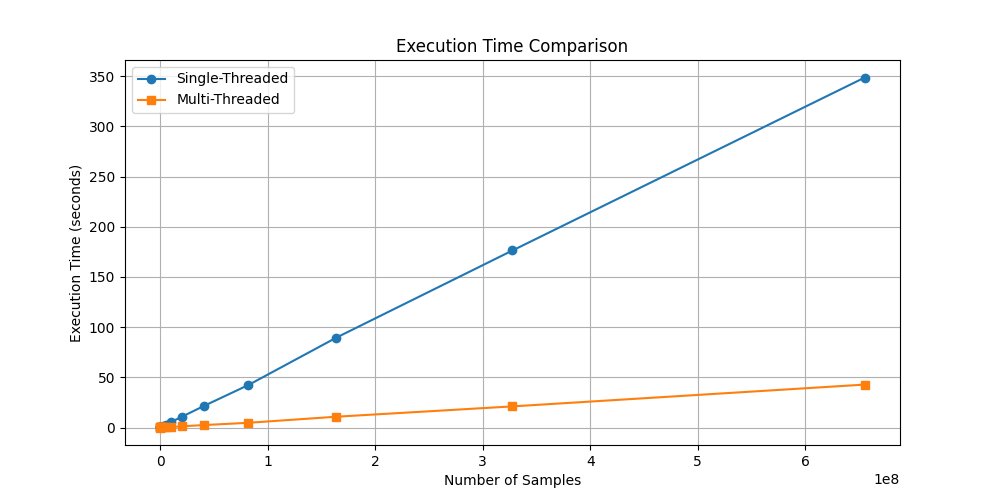
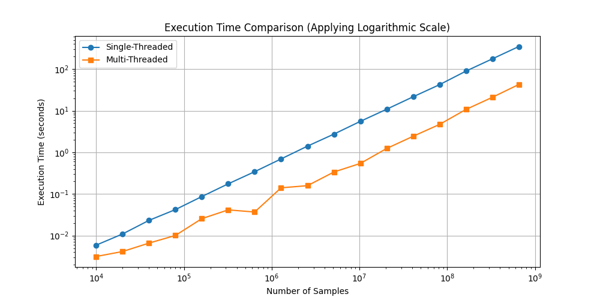
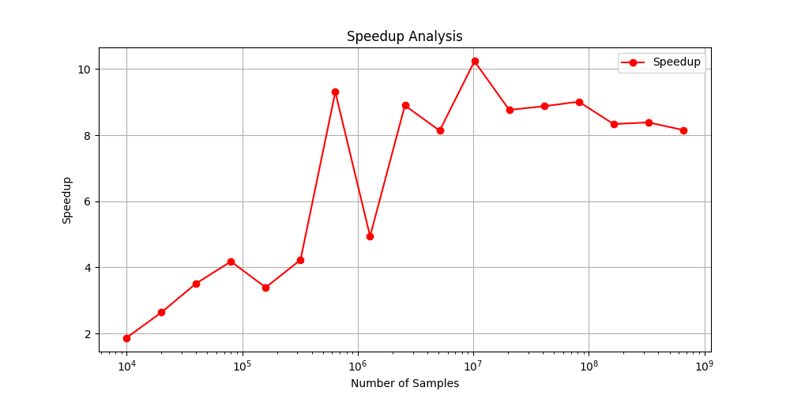
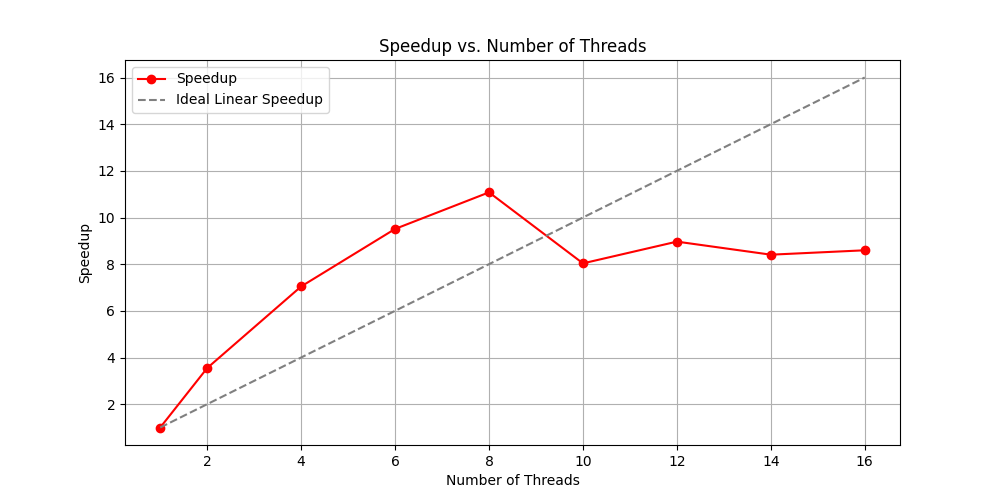

# Weather Stations Data Processing - Multi-Threaded

---
## Table of Contents
- [Weather Stations Data Processing - Multi-Threaded](#weather-stations-data-processing---multi-threaded)
  - [Table of Contents](#table-of-contents)
  - [Overview](#overview)
  - [File Structure](#file-structure)
  - [Implementation Details](#implementation-details)
    - [Workflow Overview](#workflow-overview)
    - [Thread Pool Implementation](#thread-pool-implementation)
      - [Thread Lifecycle](#thread-lifecycle)
      - [Synchronization Mechanisms](#synchronization-mechanisms)
  - [Performance Optimizations](#performance-optimizations)
      - [Use of `mmap` (Memory-Mapped File) instead of `ifstream`](#use-of-mmap-memory-mapped-file-instead-of-ifstream)
      - [Use of `unordered_map` for thread-local storage](#use-of-unordered_map-for-thread-local-storage)
  - [Analysis](#analysis)
    - [Execution Time Comparison](#execution-time-comparison)
    - [Speedup Analysis](#speedup-analysis)
  - [Build and Run](#build-and-run)
    - [Sample Output](#sample-output)
  - [Authors](#authors)
---

## Overview

This project processes weather station data from an input file using parallel processing with a thread pool. This data is read, distributed among multiple threads, processed, and aggregated to calculate the temperature statistics for each city.

## File Structure

| File                | Description |
| :----------------:  | :---------: |
| `main.cpp`          | Entry point of the program, initializes the thread pool, starts file processing, and prints results |
| `processor.cpp/h`   | Defines the `wsData` structure and implements the batch processing of weather data |
| `reader.cpp/h`      | Handles file reading, chunk division, and assigns work to threads |
| `thread_pool.cpp/h` | Implements a **thread pool** for parallel execution |

---

## Implementation Details

### Workflow Overview

1. **Thread Pool Creation**

    - The `ThreadPool` is initialized with a fixed number of worker threads
    - Each thread waits for tasks in a queue
    - Tasks are stored in a queue (`queue<function<void()>> tasks`).
    - A `condition_variable` ensures that threads are notified when tasks are available.
    - The `atomic<size_t> activeTasks` variable keeps track of the number of currently running tasks.
    - When all tasks are completed, a `condition_variable` (`finished`) is used to notify the main thread.

2. **File Reading & Chunk Division**

    - **Memory-mapped file (`mmap`)** is used for fast access instead of `ifstream` (which would be slower).
    - The file is **divided into `numThreads` chunks** to distribute work evenly among threads.
    - To prevent breaking lines in the middle, the function `findNextNewLine()` ensures that each chunk starts at a **valid line beginning**.
    - Each chunk is assigned a **start index** and **end index** within the file.

> Example:
> | Thread | Start Position | Adjusted Start | End Position |
> |--------|---------------|---------------|-------------|
> | T1 | 0 | 0 | 5,000,000 |
> | T2 | 5,000,000 | 5,000,012 | 10,000,000 |
> | ... | ... | ... | ... |
>
> The start positions are stored in `chunkStarts[]`, ensuring each thread starts at a **full line**.


3. **Parallel Processing**

    Each thread executes the following steps:

    1. **Extract its assigned chunk from the file** (`string_view chunk`).
    2. **Process each line**:
        - Split by `;` to separate city and temperature.
        - Convert the temperature to a float.
        - Store the values in a **thread-local unordered_map (`localMap`)** to avoid contention on shared data.
    3. **After processing**, each thread waits for the **final merge phase**.

4. **Aggregation and Synchronization**

    - When all threads finish, their local results (`localMap`) must be merged into the **global shared map (`wsMap`)**.

    - **This is a critical section that requires synchronization to prevent race conditions.**

    - The main thread **locks the `dataMutex`** before merging:
    ```lock_guard<mutex> lock(dataMutex);```

    - Each thread's results are added to the global map:
    ```cpp
        globalData.sum += localData.sum;
        globalData.count += localData.count;
        globalData.max = max(globalData.max, localData.max);
        globalData.min = min(globalData.min, localData.min);
    ```

    - **Why use mutex here?**
        - Multiple threads may try to update wsMap simultaneously.
        - Locking ensures that only one thread updates the shared resource at a time.
        - This prevents data corruption or undefined behavior.

### Thread Pool Implementation

#### Thread Lifecycle

1. **Threads are created in the constructor (`ThreadPool`)**

```c++
workers[i] = thread([this] { ... })
```

2. **Threads wait for tasks (`condition_variable`)**

```c++
condition.wait(lock, [this] { return !tasks.empty() || stop; });
```

3. **A task is dequeued and executed**

```c++
task = move(tasks.front());
tasks.pop();
task();
```

4. **When a thread completes a task, it updates `activeTasks` and checks if all tasks are done**

```c++
--activeTasks;
if (tasks.empty() && activeTasks == 0) finished.notify_all();
```

#### Synchronization Mechanisms

| Synchronization Tool | Purpose |
| :------------------: | :-----: |
| `mutex queueMutext`              | Protects access to the task queue |
| `condition_variable condition`   | Notifies threads when new tasks are available |
| `atomic<size_t> activeTasks`     | Tracks the number of running tasks |
| `condition_variable finished`    | Ensures that main the main thread waits for all the tasks to complete |
| `mutex dataMutex`                | Protects the shared `wsMap` from concurrent modifications |

---

## Performance Optimizations

#### Use of `mmap` (Memory-Mapped File) instead of `ifstream`

- `mmap` avoids unnecessary copies and allows **direct memory access**
- `ifstream` would require **buffering**, which slows down processing

#### Use of `unordered_map` for thread-local storage

- `unordered_map` has **O(1) average time complexity** for insertions
- Each thread has **its own copy**, reducing contention

## Analysis

To evalute the performance of the multi-threaded implementation, we compared it to a single-threaded version. The following table shows the execution times for different file sizes:

| Samples | Single-Threaded (s) | Multi-Threaded (s) |
| :---------------: | :-----------------: | :----------------: |
| 10000 | 0.00590 | 0.00315 |
| 20000 | 0.01095 | 0.00415 |
| 40000 | 0.02324 | 0.00661 |
| 80000 | 0.04216 | 0.01009 |
| 160000 | 0.0867 | 0.02555 |
| 320000 | 0.1755 | 0.04151 |
| 640000 | 0.3431 | 0.03687 |
| 1280000 | 0.6952 | 0.1407 |
| 2560000 | 1.4104 | 0.1585 |
| 5120000 | 2.7431 | 0.3372 |
| 10240000 | 5.5503 | 0.542251 |
| 20480000 | 10.8813 | 1.2417 |
| 40960000 | 21.6381 | 2.4382 |
| 81920000 | 42.2956 | 4.6937 |
| 163840000 | 89.5711 (1m 29.57s) | 10.7471 |
| 327680000 | 176.437 ( 2m 56.44s ) | 21.0411 |
| 655360000 | 348.815 (5m 48.82s) | 42.77 |


|||
|:----------------:|:----------------:|



### Execution Time Comparison
- The first plot shows the execution time of both the single-threaded and multi-threaded implementations as a function of the number of samples.
- The logarithmic scale highlights the efficiency gain, where the multi-threaded implementation consistently outperforms the single-threaded one.
- As the input size grows, the performance gets worse, showing that parallel processing provides significant benefits for large datasets.

### Speedup Analysis

- The speedup plot shows how many times faster the multi-threaded version is compared to the single-threaded one.
- The speedup increases as the dataset grows, stabilizing at around 8-10x improvement for larger inputs.
- The highest speedup (above 10x) suggests that parallel execution scales well before hitting diminishing returns.

To analyse the scalability of the multi-threaded implementation, we tested it with different numbers of threads for the same samples file (100000000 samples). For each thread count, we measured the execution time and calculated the speedup, comparing with the single thread approach. The following table shows the execution times for different thread counts:

| Threads | Execution Time (seconds) | Speedup (Sn = T1 / Tn) |
| :-----: | :----------------: | :----------------: |
| 1 | 50.649 |  1.00 |
| 2 | 14.276 |  3.55 |
| 4 |  7.190 |  7.05 |
| 6 |  5.326 |  9.51 |
| 8 |  4.572 | 11.08 |
| 10 | 6.304 |  8.04 |
| 12 | 5.649 |  8.97 |
| 14 | 6.025 |  8.41 |
| 16 | 5.893 |  8.60 |



- **Initial Speedup gains**: From **1 to 8 threads**, speedup scales well, reaching 11.08x with 8 threads.

- **Diminishing returns beyond 8 threads**: Speedup does not continue to scale linearly beyong 8 threads.

- **Optimal Thread Count**: The best performance gain is observed at **8 threads**. Increasing the number of threads beyond this point does not provide significant benefits.

---

## Build and Run

1. Clone the repository and navigate to the `multi_thread/weather-stations` directory
2. Create a build directory and run CMake to generate the build files

```bash
mkdir build
cd build
cmake ..
```

3. Build the project using the generated build files

```basheplace string_view and unordered_map with std:: equivalents, and improve error handling in file processing
make
```

4. Run the following command to generate samples giving the number of desired samples:

```bash
./cle-samples <number of samples>
```

5. Run the executable with the input file and number of threads as arguments

```bash
./cle-ws <input_file> <num_threads>
```

### Sample Output

```
Processing file: data.txt (500000000 bytes)
New York: avg=15.2 min=3.0 max=28.5
Los Angeles: avg=20.5 min=10.3 max=30.7
...
Execution Time: 14.3 seconds
```

Some scripts are also provided to automate the process of generating samples, executing the main program for all the samples created and execute the main program multiple times to avoid generating a large file with billions of samples.

- To generate samples and execute the main program for all the samples created:

```bash
cd scripts
chmod +x generate_samples.sh
./generate_samples.sh

# The samples are generated in the `samples` directory now to execute the results
chmod u+x process_samples.sh
./process_samples.sh ../samples/ 8 
# the first argument is the directory where the samples are stored
# the second argument is the number of threads to use
# If an error occurs than it might be necessary to change the path of the executable in the script
```

- To execute the main program multiple times for the same file:

```bash
cd scripts
chmod +x run_experiments.sh
./run_experiments.sh ../samples-100000000.txt 8 10
# the first argument is the file to process
# the second argument is the number of threads to use
# the third argument is the number of times to execute the program
# If an error occurs than it might be necessary to change the path of the executable in the script
# The results will be stored in a file called
```

## Authors

- [Daniel Madureira](https://github.com/Dan1m4D)
- [José Gameiro](https://github.com/zegameiro)

