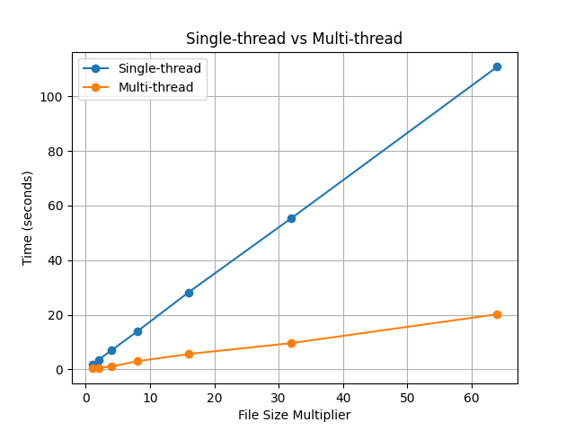
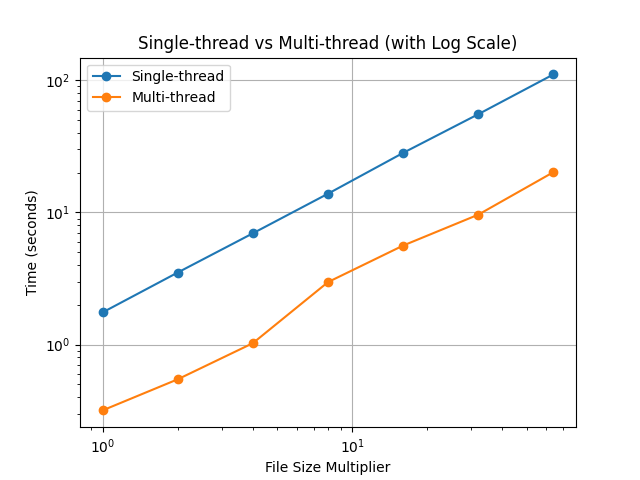
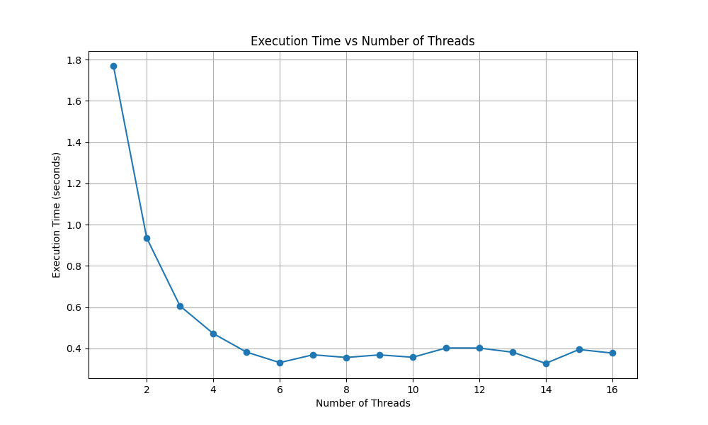
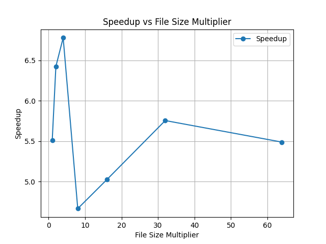
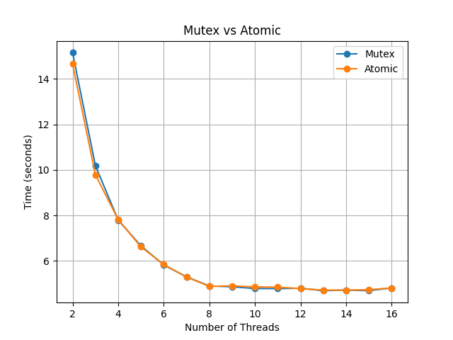
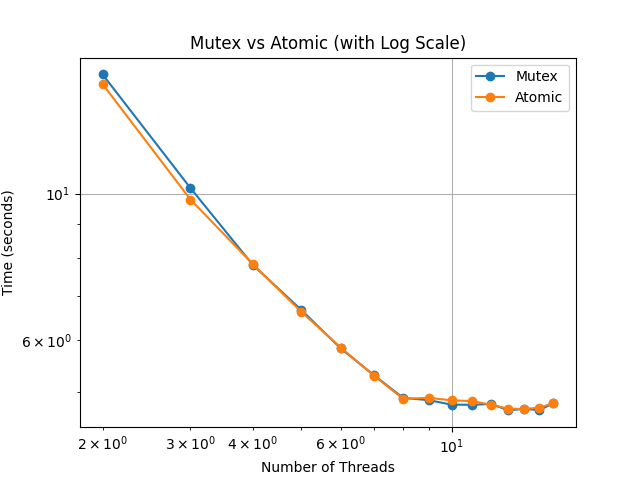

# Word Count Data Processing - Multi-Threaded

---

## Table of Contents

- [Word Count Data Processing - Multi-Threaded](#word-count-data-processing---multi-threaded)
  - [Table of Contents](#table-of-contents)
  - [Overview](#overview)
  - [File Structure](#file-structure)
  - [Implementation Details](#implementation-details)
    - [Workflow Overview](#workflow-overview)
    - [Thread Pool Implementation](#thread-pool-implementation)
      - [Thread Lifecycle](#thread-lifecycle)
      - [Synchronization Mechanisms](#synchronization-mechanisms)
  - [Analysis](#analysis)
    - [Executtion Time Comparision](#executtion-time-comparision)
    - [Speedup Analysis](#speedup-analysis)
    - [Atomic vs Mutex](#atomic-vs-mutex)
  - [How to run](#how-to-run)
    - [Bonus: How to run the tests](#bonus-how-to-run-the-tests)
  - [Authors](#authors)

---

## Overview

This project processes a group of books and counts the number of words, lines, and characters in UTF-8 encoded text files. The program reads the files in parallel using multiple threads and counts the number of words, lines, and characters in each file. In the end, the program prints the total number of words, lines, and characters in all the files.

## File Structure

|        File         |                                                                   Description                                                                   |
| :-----------------: | :---------------------------------------------------------------------------------------------------------------------------------------------: |
|     `main.cpp`      |                       Entry point of the program, initializes the thread pool, starts file processing, and prints results                       |
|   `globals.cpp/h`   | Defines the global variables to be used, in this case, the total lines, chars, and words, both as `int` and `atomic<int>`, and a global `mutex` |
| `word_count.cpp/h`  |                  Implements the logic to count the words, lines, and characters of each file and to add to the global counters                  |
|    `utf-8.cpp/h`    |                     Implements the logic to read UTF-8 encoded files and to recognize letters and spaces in UTF-8 encoding                      |
| `thread_pool.cpp/h` |                                               Implements a **thread pool** for parallel execution                                               |

## Implementation Details

### Workflow Overview

1. **Read** the input file and **store the files** in a vector

   - The `input file` contains the paths to the files to be processed.
   - The `vector` stores the paths to the files to be processed.
   - As the file is read, the paths are stored in the vector.

2. **Thread Pool Initialization**

   - The `ThreadPool` is initialized with a fixed number of worker threads.
   - Each thread waits for tasks in a queue.
   - Tasks are stored in a queue (`queue<function<void()>> tasks`).
   - A `condition_variable` ensures that threads are notified when tasks are available.
   - The `atomic<size_t> activeTasks` variable keeps track of the number of currently running tasks.
   - When all tasks are completed, a `condition_variable` (`finished`) is used to notify the main thread.

3. **File Division**

   - Each **thread** reads a **file** from the vector and **processes** it.

4. **Parallel Processing**

   - Each thread executes the following steps:
     - Initialize counters for characters, lines, and words to zero.
     - Initialize variables for the current byte, previous byte, and word detection.
     - Open the file using an `ifstream` object.
     - Read the file byte by byte.
     - If the chars flag is set, increment the character counter.
     - Decode the byte into a Unicode codepoint.
     - If decoding is successful:
       - If the `words` flag is set:
         - Check if the codepoint is a space character (`utf8_is_space(codepoint)`).
         - Update the word counter and the word detection flag accordingly.
       - If the `lines` flag is set:
         - Increment the line counter if the codepoint is a newline character.
       - Update the previous byte with the current codepoint.
     - If the last byte is not a `newline` character, increment the line counter.

5. **Aggregation and Synchronization**

   - After processing each file, the thread adds the number of characters, lines, and words to the global counters.
   - To ensure that the global counters are updated correctly, we use either:
     - `mutex` to lock the critical section.
     - `atomic` variables to ensure that the counters are updated atomically.

   > We will discuss the performance of both methods in the [analysis section](#atomic-vs-mutex).

### Thread Pool Implementation

#### Thread Lifecycle

1. Threads are created in the **constructor** (`ThreadPool`)

```c++
workers[i] = thread([this] { ... })
```

2. Threads **wait** for **tasks** (`condition_variable`)

```c++
condition.wait(lock, [this] { return !tasks.empty() || stop; });
```

3. A task is **dequeued** and **executed**

```c++
task = move(tasks.front());
tasks.pop();
task();
```

4. When a thread **completes a task**, it **updates** `activeTasks` and checks if **all tasks are done**

```c++
--activeTasks;
if (tasks.empty() && activeTasks == 0) finished.notify_all();
```

#### Synchronization Mechanisms

|      Synchronization Tool      |                                   Purpose                                    |
| :----------------------------: | :--------------------------------------------------------------------------: |
|      `mutex queueMutext`       |                    Protects access to the **task queue**                     |
| `condition_variable condition` |            **Notifies** threads when **new tasks** are available             |
|  `atomic<size_t> activeTasks`  |                  **Tracks** the number of **running** tasks                  |
| `condition_variable finished`  | Ensures that the **main** thread **waits** for all the tasks to **complete** |
|       `mutex dataMutex`        |        Protects the shared `wsMap` from **concurrent modifications**         |

---

## Analysis

To evaluate the performance of the program, we will compare the execution time of the single-threaded and multi-threaded versions. We will also analyze the speedup achieved by using multiple threads. Later, we will compare the performance of using `atomic` variables versus `mutex` locks.

### Executtion Time Comparision

In order to compare the execution time of the single-threaded and multi-threaded versions, we will measure the time taken to process a set of files with different sizes. The following table and graphs show the execution time of the program for different file sizes, starting with the original file and increasing the size by a factor of 2:

| File Size (Multiplier) | Single Thread (s) | Multi-thread (s) |
| ---------------------- | ----------------- | ---------------- |
| x1                     | 1.8726            | 0.3430           |
| x2                     | 3.7633            | 0.6399           |
| x4                     | 7.3771            | 1.2220           |
| x8                     | 14.9088           | 3.7480           |
| x16                    | 29.7836           | 5.9602           |
| x32                    | 58.8018           | 10.3568          |
| x64                    | 117.2397          | 19.5663          |

|  |  |
| ------------------------------------------ | ---------------------------------------------- |

We can observe a few things from the tables and graphs:

- The multi-threaded version is **significantly faster** than the single-threaded version for all file sizes.
- The single-threaded execution time shows a **near-linear** increase with the file size multiplier. In contrast, the multi-threaded execution time increases at a much slower, **sub-linear** rate.

We also measured the execution time of the program with the original file size and increasing the number of threads:

| Number of Threads | Time (s) |
| ----------------- | -------- |
| 1                 | 1.7700   |
| 2                 | 0.9356   |
| 3                 | 0.6062   |
| 4                 | 0.4721   |
| 5                 | 0.3821   |
| 6                 | 0.3309   |
| 7                 | 0.8109   |
| 8                 | 0.3560   |
| 9                 | 0.3685   |
| 10                | 0.3569   |
| 11                | 0.4019   |
| 12                | 0.4017   |
| 13                | 0.3815   |
| 14                | 0.3273   |
| 15                | 0.3946   |
| 16                | 0.3772   |



We can take a few observations from the tables and graphs:

- There is a **significant decrease** in execution time when increasing the number of threads, up to a **certain point**.
- The **optimal** number of threads is around **6 threads**.
- After reaching the optimal number of threads, adding more threads **does not lead to a significant decrease** in execution time. In fact, the execution time starts to fluctuate and even slightly increase, indicating diminishing returns.
- The **overhead** of creating and managing threads starts to **outweigh** the benefits of parallelism when the number of threads is too **high**.

### Speedup Analysis

The speedup is calculated as the ratio of the execution time of the single-threaded version to the execution time of the multi-threaded version. The following table and graphs show the speedup achieved by using multiple threads for different file sizes:

| File Size (Multiplier) | SpeedUp |
| ---------------------- | ------- |
| x1                     | 5.5114  |
| x2                     | 6.4250  |
| x4                     | 6.7788  |
| x8                     | 4.6643  |
| x16                    | 5.0242  |
| x32                    | 5.7547  |
| x64                    | 5.4879  |



We can observe a few things from the tables and graphs:

- **Overall SpeedUp**: The SpeedUp increases as the file size multiplier increases, averaging around 5.5x.
- **Initial Increase in SpeedUp**: The graph shows a rapid increase in SpeedUp from x1 to x4 file size multipliers. This indicates that as the file size increases initially, the multi-threading is becoming significantly more effective at reducing execution time.
- **sharp Drop in SpeedUp at x8**: A dramatic drop in SpeedUp is observed at x8. This suggests that at this file size, the multi-threading is encountering limitations, leading to a substantial decrease in performance gain compared to single-threading.
- **Recovery and Stabilization of SpeedUp**: After the dip at x8, the SpeedUp starts to recover and stabilize. It increases from x16 to x64, showing that the multi-threading becomes more effective again as the file size continues to increase.
- **Peak Performance Around x4**: The peak SpeedUp occurs at x4, indicating that this file size multiplier provides the most significant performance improvement through multi-threading.

### Atomic vs Mutex

For **synchronization**, we can use either `atomic` variables or `mutex` locks. We will compare the performance of both methods by measuring the **execution time** of the program while increasing the number of **threads**. The following table and graphs show the execution time of the program using `atomic` variables and `mutex` locks for synchronization with a file size with x16 multiplier:

| Number of Threads | Mutex (s) | Atomic (s) | SpeedUp | Efficiency |
| ----------------- | --------- | ---------- | ------- | ---------- |
| 2                 | 15.1546   | 14.6537    | 1.0342  | 0.5171     |
| 3                 | 10.1930   | 9.7935     | 1.0408  | 0.3469     |
| 4                 | 7.7958    | 7.8178     | 0.9972  | 0.2493     |
| 5                 | 6.6644    | 6.6203     | 1.0067  | 0.2013     |
| 6                 | 5.8244    | 5.8425     | 0.9969  | 0.1662     |
| 7                 | 5.3017    | 5.2931     | 1.0016  | 0.1431     |
| 8                 | 4.9021    | 4.8862     | 1.0032  | 0.1254     |
| 9                 | 4.8636    | 4.9032     | 0.9919  | 0.1102     |
| 10                | 4.7880    | 4.8602     | 0.9851  | 0.0985     |
| 11                | 4.7848    | 4.8474     | 0.9871  | 0.0897     |
| 12                | 4.8005    | 4.7871     | 1.0028  | 0.0836     |
| 13                | 4.6927    | 4.7189     | 0.9945  | 0.0765     |
| 14                | 4.7199    | 4.7177     | 1.0005  | 0.0715     |
| 15                | 4.6964    | 4.7367     | 0.9915  | 0.0661     |
| 16                | 4.8139    | 4.8125     | 1.0003  | 0.0625     |

|  |  |
| ----------------------------------------------- | --------------------------------------------------- |

As we can see from the graph, the performance of the program using `atomic` variables and `mutex` locks is **very similar**. The execution time of the program using `atomic` variables is slightly **faster** than using `mutex` locks. However, the difference is **minimal**, and both methods provide similar performance.

## How to run

1. Clone the repository and navigate to the project directory:

   ```bash
   git clone git@github.com:ua-cle/2425-tp1-group11.git
   ```

2. Create the build directory and generate the build files:

   ```bash
    mkdir build
    cd build
    cmake ..
   ```

3. Build the project:

   ```bash
    make
   ```

4. Make the input file with the paths of the files to be processed:

   ```bash
   ls books > books.txt
   ```

   > The `books` directory contains the files to be processed.
   >
   > ```bash
   > books
   > ├── 11299.txt
   > ├── 12579.txt
   > ├── 13092.txt
   > ├── 13093.txt
   > ├── 13630.txt
   > ├── 14296.txt
   > ├── 14503.txt
   > ├── 14620.txt
   > ├── 14621.txt
   > └── ...
   > ```

5. Run the program with the desired flags:
   `bash
 ./cle-wc books.txt
`
   > You can see the available flags by running the program with the `--help` flag.
   >
   > ```bash
   > ./cle-wc --help
   > # Usage: cle-wc [options] input_file.txt
   > # Options:
   > #   -l, --lines          Count lines
   > #   -w, --words          Count words
   > #   -c, --chars          Count characters
   > #   -t, --threads N      Use N threads (default: hardware concurrency)
   > #   -a, --atomic         Use atomic operations for global counters
   > #   -h, --help           Show this help message
   > ```
   >
   > The program by **default** counts the number of **lines**, **words**, and **characters** in the files using the **number of threads** equal to the **hardware concurrency** and **mutex** locks for synchronization.

### Bonus: How to run the tests

1. Make sure you have `Python3` installed:

   ```bash
   python3 --version
   # Python 3.13.2
   ```

2. Install the `matplotlib` library:

   ```bash
   pip3 install matplotlib
   ```

3. Run the python script to generate the test files:
   `bash
python3 run.py --output-dir {your_output_dir} --executable ./cle-wc  --input-file books.txt
`
   It takes around **10 minutes** to run all the tests. After the tests are done, you can find the plots and the results in the output directory:

```bash
{your_output_dir}
├── csv
│   ├── atomic_mutex_results.csv
│   ├── compare_results.csv
│   └── progressive_threads_results.csv
└── images
    ├── atomic.png
    ├── comparison.png
    ├── efficiency.png
    ├── multi_thread.png
    ├── mutex.png
    ├── mutex_vs_atomic.png
    ├── progressive_threads.png
    ├── single_thread.png
    └── speedup.png
```

## Authors

- [Daniel Madureira](https://github.com/Dan1m4D)
- [José Gameiro](https://github.com/zegameiro)
````
