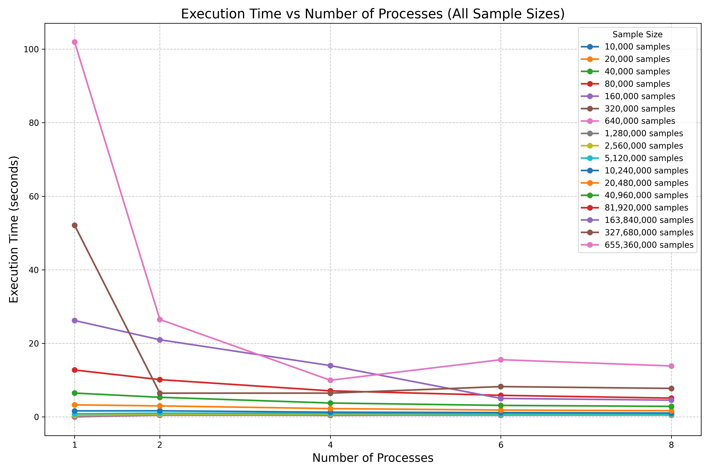
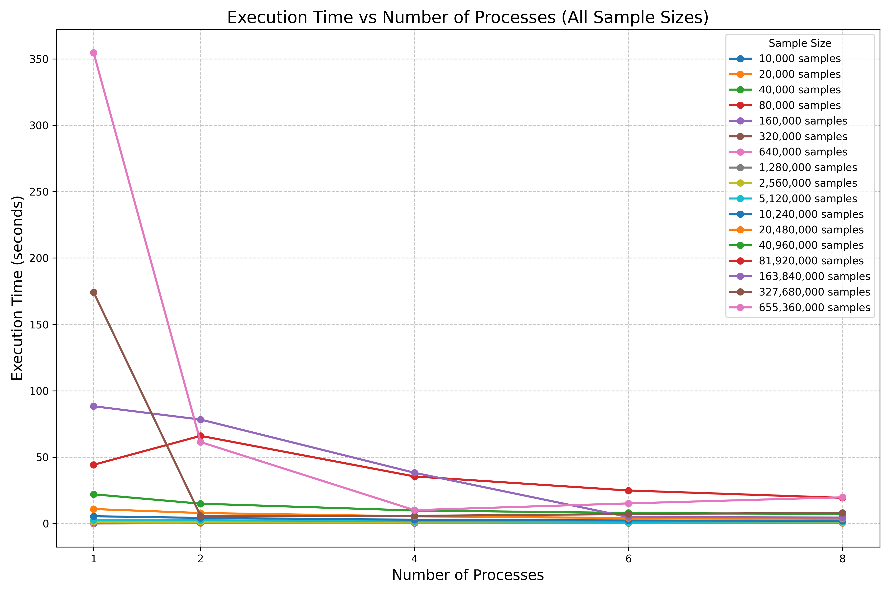
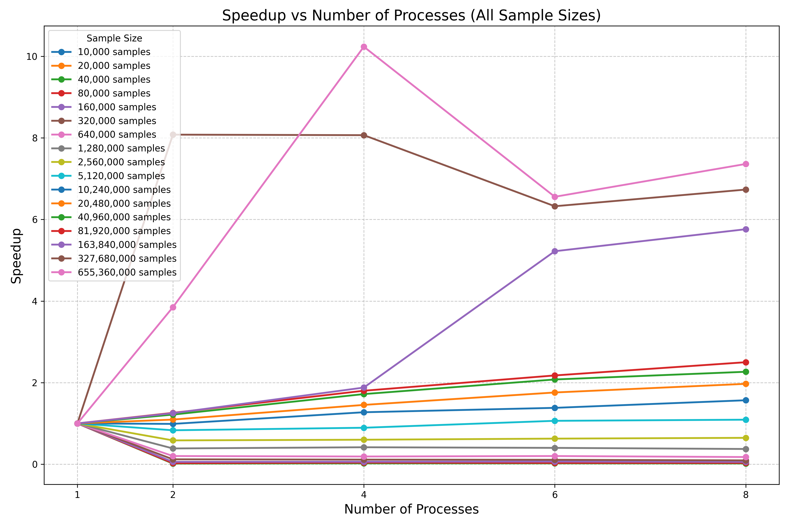
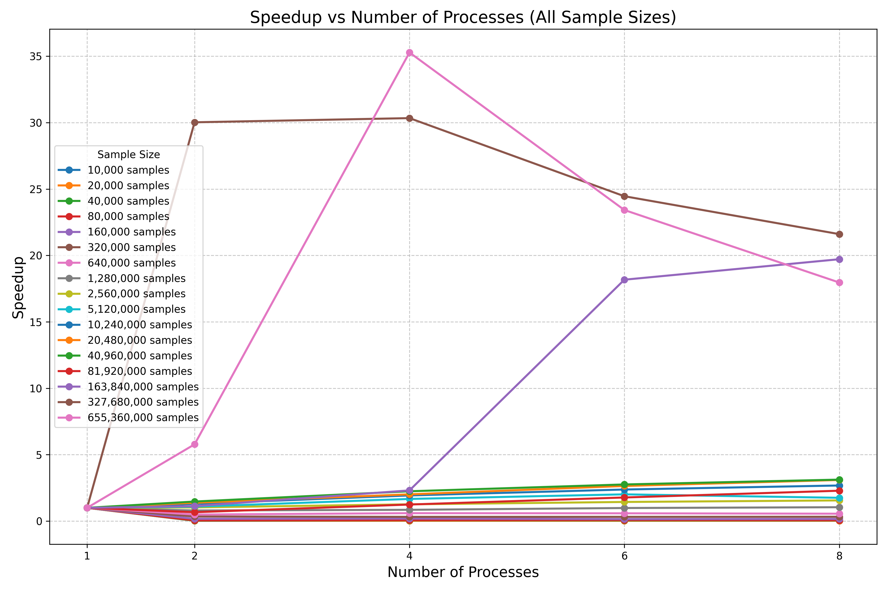

# Weather Stations Data Processing - MPI

This project is an MPI-based distributed-memory application that processes weather station data. It reads a temperature dataset with multiple entries per city, distributes chunks of this data across MPI processes, and computes the **average**, **minimum**, and **maximum** temperatures per city. The final results are collected and merged on the root process (rank 0).

---
## Table of Contents
- [Weather Stations Data Processing - MPI](#weather-stations-data-processing---mpi)
  - [Table of Contents](#table-of-contents)
  - [File Structure](#file-structure)
  - [Data format](#data-format)
  - [MPI Workflow](#mpi-workflow)
    - [1. Initialization and Input Distribution](#1-initialization-and-input-distribution)
    - [2. Local Processing of Weather Data](#2-local-processing-of-weather-data)
    - [3. Data Structuring for MPI Communication](#3-data-structuring-for-mpi-communication)
    - [4. Tree-based Gathering of Results](#4-tree-based-gathering-of-results)
    - [5 Final Output and Timing](#5-final-output-and-timing)
  - [Experimental Analysis](#experimental-analysis)
      - [Results obtained for all the samples with different number of processes and with optimization -O3](#results-obtained-for-all-the-samples-with-different-number-of-processes-and-with-optimization--o3)
      - [Results obtained for all the samples with different number of processes and with no optimization](#results-obtained-for-all-the-samples-with-different-number-of-processes-and-with-no-optimization)
      - [Speedup results obtained for all the samples with different number of processes and with optimization -O3](#speedup-results-obtained-for-all-the-samples-with-different-number-of-processes-and-with-optimization--o3)
      - [Speedup results obtained for all the samples with different number of processes and with no optimization](#speedup-results-obtained-for-all-the-samples-with-different-number-of-processes-and-with-no-optimization)
    - [Single-Threaded/Original-Version vs MPI](#single-threadedoriginal-version-vs-mpi)
  - [Compilation and Execution](#compilation-and-execution)

## File Structure

| File | Purpose |
| :--: | :-----: |
| `main.cpp` | Entry point of the application. Initializes MPI, coordinates processing, and prints final results |
| `processor.cpp` | Handles file reading, chunking, and per-process parsing of temperature records |
| `gather.cpp` | Performs merging of per process city data into a single global map using a binary tree gather strategy |
| `types.cpp` | Defines and registers custom MPI datatypes (`wsData`, `CityData`) needed for communication |
| `*.h` | Corresponding header files with data structures and function prototypes |

---

## Data format

Each line in the input file must follow this format:
```txt
<city_name>;<temperature>;
```

Example
```txt
New York;25.5;
Los Angeles;30.0;
Chicago;15.0;
```

---

## MPI Workflow

The workflow of this application can be broken down into several key steps:

### 1. Initialization and Input Distribution

At the start of the program:
- **MPI Initialization** takes place, and each process retrieves its `rank` and the total number of processes (`size`)
- The root process (**rank 0**) opens the input file and reads it into a memory buffer. It calculates how to divide this buffer into approximately equal-sized chunks while making sure each chunk ends at a newline character. This is crucial to avoid splitting a line between two processes
- Arrays `sendcounts` and `displs` are computed to store:
    - `sendcounts[i]`: Number of bytes (characters) that process `i` will receive
    - `displs[i]`: Byte offset in the buffer from which process `i` will start reading its chunk
- The full buffer and metadata are then used in a call to `MPI_Scatterv`, sending a string chunk to each process
- Each process receives its chunk and parses it independently

### 2. Local Processing of Weather Data

Each process reads its chunk line by line and parses it using a simple `city;temperature` format.
- For each line
    - It splits the line at `;`
    - Converts the temperature to a float
    - Updates a local map `std::map<std::string, wsData>`, where `wsData` stores:
        - `sum` of temperatures
        - `count` of entries
        - `min` and `max` observed temperature
- This forms a per-process summary of all temperature data it received

### 3. Data Structuring for MPI Communication

To share structured data between processes, custom MPI types are defined:
- `wsData`: A struct containing:
    - `float sum`
    - `int count`
    - `float min`
    - `float max`
- `CityData`: A struct that holds:
    - `char city[100]` - the name of the city
    - `wsData data` - the aggregated weather data

These types are registered with MPI using `MPI_Tupe_create_struct` and committed for safe transmission of complex records

---

### 4. Tree-based Gathering of Results

The merging of local maps is done using a parallel merge pairwise strategy, where:
- At each iteration
    - Processes with ranks divisible by `2 * step` receive data from their neighbor `(rank + step)`
    - Those with `rank % (2 * step) != 0` send their data to `rank - step` and exit the loop
- This method reduces communication overhead and improves performance compared to a flat `MPI_Gather`

Setps inside the merging:
- The sending process serializes its local map into a buffer of `CityData[]`
- The receiving process receives the buffer, reconstructs the map, and merges it into its own using the function `mergeMaps`
    - If a city exists in both maps, its `sum`, `count`, `min`, and `max` values are combined
    - If the city is new, it is simply added to the target map

This continues until rank 0 has received and merged all partial maps from every other process

### 5 Final Output and Timing

- Only the root process (rank 0) prints the final results
    - It computes and displaus the **average**, **min**, and **max** temperature for each city
- The program measures and reports the total execution time

## Experimental Analysis

In order to evaluate the performance of our solution, we conducted an experiment to measure the execution time of the program with multiple files that contain different number of samples.

The number of samples varies from 10,000 to 655,360,000, where each for each file the number of samples was duplicated until it reached 655,360,000. The files were generated using a script that creates random temperatures for each city.

All the files created were executed with multiple number of processes, ranging from 2 until 8 processes, with increments of 2. 

We also tested the program while compiling it with optimization (-O3) and without optimization. The results of the experiment can be found in the [result](./results/).

Some visualization were also used to analyze the results. To generate them, we used a simple [python script](./visualizations.py), and the visualizations can be found in the  [visualizations folder](./charts/).

#### Results obtained for all the samples with different number of processes and with optimization -O3



#### Results obtained for all the samples with different number of processes and with no optimization



#### Speedup results obtained for all the samples with different number of processes and with optimization -O3



#### Speedup results obtained for all the samples with different number of processes and with no optimization



From these results, we can conclude that:

- Using the `-O3` optimization flag during compilation consistently let to faster execution times across all dataset sizes.

- The difference was especially noticeable for large files, like for example, 819,200,000 samples with 2 processes: **~66s (without optimization)** vs **~10s (with -O3)** - over **6x faster**

- For small datasets (like 10,000 to 320,000 samples), MPI parallelism doesn't significantly improve runtime, and sometimes slightly degrades, possibly due to:
    - Communication overhead (`MPI_Scatterv`)
    - Serialization and merging overhead

- For larger datasets (like 10 million samples and above), performance scales better with more processes, showing the parallelism is effective in CPU-bound scenarios

- The parallel merge sort strategy reduced bottlenecks in the gather phase, avoiding the issues typical in flat `MPI_Gather` operations for large data

- Generally, 4 and 6 processes offered the best balance between speed and overhead

- 8 processes sometimes had diminishing returns or even slightly worse performance for smaller files, suggesting **over-parallelization** beyong the task's granularity

- Chunking logic that ensures each MPI process ends its chunk at a newline preserved line integrity and avoided parsing errors.

- Some outliers can be observed:
    - For example, `32,760,000 samples` with 6 and 9 processes performed **worse** than with 2 or 4 processes (even with `-O3`), indicating potential system-level issues such as memory saturation, I/O contentionm or MPI buffer limits

- The **speedup** for large datasets was generally sublinear but impactful:
    - For example, `204,800,000 samples` with 2 vs. 8 processes: from **~3s to ~1.66s** with `-O3` optimization, a **~1.8x speedup**
    -  This is acceptable given the merging, communication, and synchronization involved in MPI workloads.

### Single-Threaded/Original-Version vs MPI

To evaluate the effectiveness of our MPI implementation, we benchmarked both single-threaded and multi-process versions of the application across the same datasets used in the previous experiment, compiling with and without optimization (`-O3`). Below are our conclusions:

- Across all tests, using `-O3` provided **huge speed improvements** for both the single-threaded and MPI versions, for example, for `655,360,000 samples` with 1 process:
    - Without optimization: **354.58s**
    - With optimization (`-O3`): **101.94s**
    - A **~3.47x speedup** was achieved by using the `-O3` flag 

- For small files, the single-threaded version was consistently faster, because MPI adds overhead for scattering, communication, and gathering that outweights benefits at small scale

- For medium to large datasets (>= ~10M samples), MPI begins to **outperform single threaded**, especially with 4+ processes:
    - For example `~204M` samples, with 1 process, **3.27s**, with 8 processes, **1.66s**, meaning that its **~2x faster**
    - For `~655M` samples, with 1 process, **101.94s**, with 8 processes, **~9.96s**, meaning that its **~10x faster** 

- Speedup improves up to a certain number of processes, typically around 4-6, for example with `655M samples` and `-O3` optimization:
    - 1 process: **~101.94s**
    - 2 processes: **~26.49s**
    - 4 processes: **~9.96s**
    - 6 processes: **~15.55s**
    - 8 processes: **~13.85s**

## Compilation and Execution

To compile the program, you can follow these steps:

1. First create a build directory:
```bash
mkdir build
cd build
```

2. Then generate a makefile using CMake:
```bash
cmake ..
```

3. Finally compile everything with:
```bash
make
```

4. You can execute the program using:
```bash
mpirun -n <number_of_processes> ./cle-ws-mpi <samples_file>
# You can also use mpiexec instead of mpirun
```
