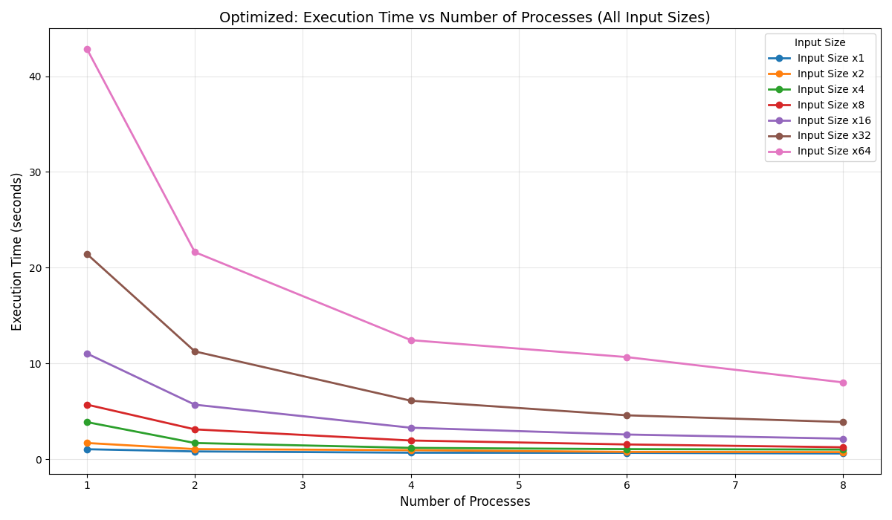
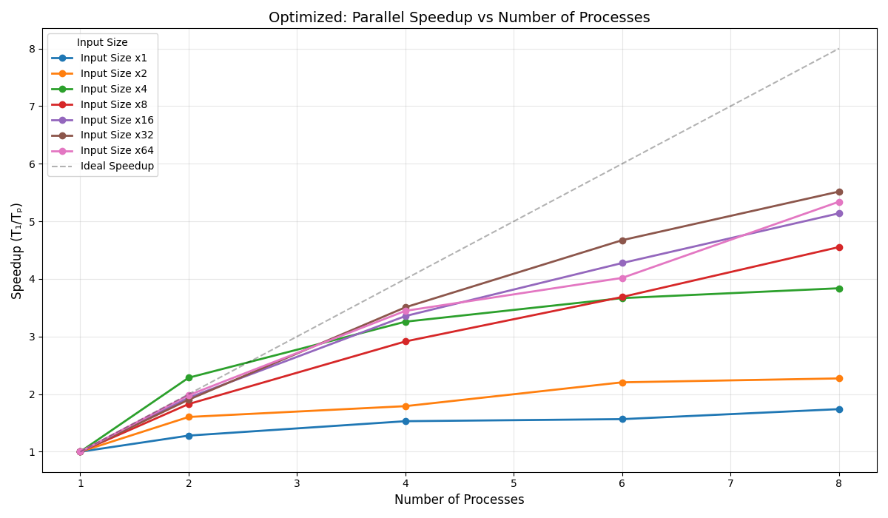
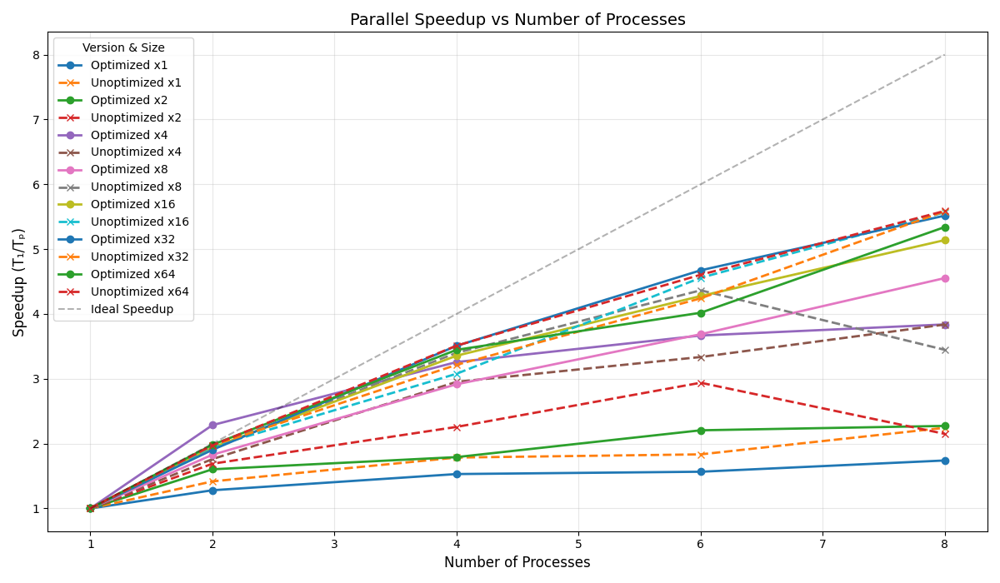
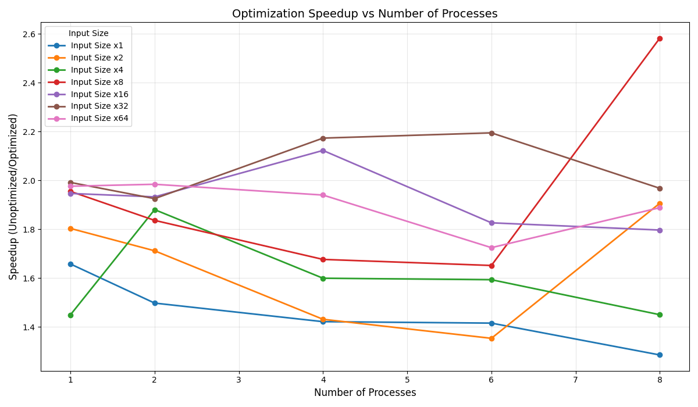

# Word Count Data Processing - MPI

This project is an MPI-based distributed-memory application that processes word count data. It reads a input file with the path to multiple files, reads the files, distributes the files across MPI processes, and computes the **char**, **word** and **line** count for each file. The final results are collected and merged on the root process (rank 0).

---

## Table of Contents

- [Word Count Data Processing - MPI](#word-count-data-processing---mpi)
  - [Table of Contents](#table-of-contents)
  - [File Structure](#file-structure)
  - [Data Format](#data-format)
  - [Workflow](#workflow)
  - [Experimental Analysis](#experimental-analysis)
  - [Optimization Analysis](#optimization-analysis)
  - [How to run](#how-to-run)
    - [Bonus: How to run the tests](#bonus-how-to-run-the-tests)

---

## File Structure

|       File       |                                                             Purpose                                                              |
| :--------------: | :------------------------------------------------------------------------------------------------------------------------------: |
|    `main.cpp`    | Entry point of the application. Initializes MPI, parses command line arguments, coordinates processing, and prints final results |
| `processor.cpp`  |                    Handles the distribution of files, parallel processing coordination, and results gathering                    |
| `word_count.cpp` |                              Handles the word, line and char counting for either a file or a buffer                              |
|   `utf-8.cpp`    |                                               Handles UTF-8 encoding and decoding                                                |
|   `reader.cpp`   |                                    Handles reading files to buffers and file list processing                                     |
|   `types.cpp`    |                                     Defines the custom datatypes used for MPI communication                                      |
|      `**.h`      |                                           Header files for the respective source files                                           |

## Data Format

The input file must contain the paths to the files to be processed, one per line. Each file will be processed independently.

- Example input file:

```txt
/path/to/file1.txt
/path/to/file2.txt
/path/to/file3.txt
```

## Workflow

This application follows a distributed-memory architecture using MPI. The workflow can be broken down into several key steps:

1. **Initialization and Command Line Processing**

   - The program starts by initializing MPI and determining the rank and size of the processes.
   - The master process (rank 0) parses command line arguments to determine which counts to perform (lines, words, chars).
   - These flags are then broadcast to all worker processes.

2. **File List Distribution**

   - The master process reads the input file containing a list of files to process.
   - The total number of files is broadcast to all processes.
   - The master process calculates how many files each process will handle (chunking).
   - Filenames are distributed to worker processes using MPI_Scatterv.

3. **Parallel Processing of Files**

   - Each process (including master) reads and processes its assigned files independently.
   - For each file, the process counts lines, words, and characters according to the specified flags.
   - Each process stores its results locally in a vector of WordCountResult objects.

4. **Results Gathering and Aggregation**
   - The master process gathers the results from all worker processes using MPI_Gatherv.
   - A custom MPI datatype is used to efficiently transfer the structured data.
   - The master process merges and formats all results for output.

## Experimental Analysis

In order to analyze the performance of the application, we conducted a series of experiments with varying file sizes and numbers of processes.

We varied the number of processes from 1 (similar to the original) to 8, with increments of 2. The file sizes were also varied, with multipliers of 1, 2, 4, 8, 16, 32 and 64. The file sizes were generated by consecutively appending the same file to itself, effectively doubling the size each time.
The results can be seen in the following table and graph:

| Number of Processes | Size (Multiplier) | Execution Time (s) |
| :-----------------: | :---------------: | :----------------: |
|          1          |         1         |        1.05        |
|          2          |         1         |        0.90        |
|          4          |         1         |        0.77        |
|          6          |         1         |        0.67        |
|          8          |         1         |        0.61        |
|          1          |         2         |        1.74        |
|          2          |         2         |        1.06        |
|          4          |         2         |        0.90        |
|          6          |         2         |        0.79        |
|          8          |         2         |        0.77        |
|          1          |         4         |        3.01        |
|          2          |         4         |        1.71        |
|          4          |         4         |        1.19        |
|          6          |         4         |        1.01        |
|          8          |         4         |        0.98        |
|          1          |         8         |        5.61        |
|          2          |         8         |        3.02        |
|          4          |         8         |        1.84        |
|          6          |         8         |        1.54        |
|          8          |         8         |        1.37        |
|          1          |        16         |       10.88        |
|          2          |        16         |        5.71        |
|          4          |        16         |        3.20        |
|          6          |        16         |        2.52        |
|          8          |        16         |        2.17        |
|          1          |        32         |       21.40        |
|          2          |        32         |       10.99        |
|          4          |        32         |        7.10        |
|          6          |        32         |        5.78        |
|          8          |        32         |        4.03        |
|          1          |        64         |       42.49        |
|          2          |        64         |       21.61        |
|          4          |        64         |       12.72        |
|          6          |        64         |       10.38        |
|          8          |        64         |        7.35        |

|  |  |
| :-----------------------------------------------------------------: | :---------------------------------------------------------------: |

The individual graphs for each file size can be consulted in the [results/images/optimized](results/images/optimized) directory. The graphs show the execution time and speedup as a function of the number of processes for different file sizes.

From the results, we can take the following conclusions:

- ### Strong Scaling Effect

  - For each file size, increasing the number of processes consistently reduces execution time
  - The most dramatic improvement occurs when going from 1 to 2 processes (nearly halving the time). This is likely due to the fact that the workload is split between two processes, allowing for better utilization of resources.
  - The performance gains diminish with each additional process (following Amdahl's law)

- ### Scalability with File Size

  - For small files (multiplier 1-2), adding processes beyond 4 offers minimal benefit
  - For large files (multiplier 32-64), performance continues to improve meaningfully up to 8 processes
  - The speedup is more pronounced with larger files - at multiplier 64, going from 1 to 8 processes reduces execution time from 42.49s to 7.35s (5.78x faster)

- ### Efficiency Analysis

  - Ideal linear speedup would be proportional to the number of processes
  - The actual speedup achieved ranges from approximately 1.7x (for small files) to 5.8x (for large files) when using 8 processes
  - Efficiency (speedup/number of processes) decreases as you add more processes, but remains higher for larger files, indicating that the workload is more evenly distributed.

- ### Overhead Observations
  - The diminishing returns with more processes indicate communication and coordination overhead
  - This overhead is more significant relative to computation time for smaller files - because the time spent in communication is a larger fraction of the total execution time
  - For larger files, the computation time dominates, leading to better scaling
  - The overhead is more pronounced when using 1 process, as the entire workload is handled by a single process, leading to longer execution times
  - For large files, the computation-to-communication ratio is more favorable

## Optimization Analysis

We also analyzed the impact of using optimization when compiling the code. We compared the execution time of the optimized (o3) and non-optimized versions of the application. The results are shown in the following table and graph:

| Size (Multiplier) | Processes | Optimized Time (s) | Unoptimized Time (s) | Speedup (Unopt/Opt) |
| :---------------: | :-------: | :----------------: | :------------------: | :-----------------: |
|         1         |     1     |        1.05        |         1.74         |        1.66         |
|         1         |     2     |        0.82        |         1.23         |        1.50         |
|         1         |     4     |        0.69        |         0.97         |        1.42         |
|         1         |     6     |        0.67        |         0.95         |        1.42         |
|         1         |     8     |        0.60        |         0.78         |        1.29         |
|         2         |     1     |        1.70        |         3.07         |        1.80         |
|         2         |     2     |        1.06        |         1.82         |        1.71         |
|         2         |     4     |        0.95        |         1.36         |        1.43         |
|         2         |     6     |        0.77        |         1.04         |        1.35         |
|         2         |     8     |        0.75        |         1.43         |        1.91         |
|         4         |     1     |        3.89        |         5.63         |        1.45         |
|         4         |     2     |        1.70        |         3.20         |        1.88         |
|         4         |     4     |        1.19        |         1.91         |        1.60         |
|         4         |     6     |        1.06        |         1.69         |        1.59         |
|         4         |     8     |        1.01        |         1.47         |        1.45         |
|         8         |     1     |        5.71        |        11.16         |        1.95         |
|         8         |     2     |        3.12        |         5.74         |        1.84         |
|         8         |     4     |        1.96        |         3.28         |        1.68         |
|         8         |     6     |        1.55        |         2.56         |        1.65         |
|         8         |     8     |        1.25        |         3.24         |        2.58         |
|        16         |     1     |       11.05        |        21.51         |        1.95         |
|        16         |     2     |        5.70        |        11.02         |        1.93         |
|        16         |     4     |        3.29        |         6.99         |        2.12         |
|        16         |     6     |        2.58        |         4.72         |        1.83         |
|        16         |     8     |        2.15        |         3.86         |        1.80         |
|        32         |     1     |       21.45        |        42.71         |        1.99         |
|        32         |     2     |       11.26        |        21.69         |        1.93         |
|        32         |     4     |        6.11        |        13.29         |        2.17         |
|        32         |     6     |        4.59        |        10.07         |        2.19         |
|        32         |     8     |        3.89        |         7.65         |        1.97         |
|        64         |     1     |       42.87        |        84.72         |        1.98         |
|        64         |     2     |       21.63        |        42.92         |        1.98         |
|        64         |     4     |       12.44        |        24.13         |        1.94         |
|        64         |     6     |       10.67        |        18.40         |        1.72         |
|        64         |     8     |        8.03        |        15.16         |        1.89         |

|  |  |
| :------------------------------------------------------------------------------------: | :-------------------------------------------------------------------------------------: |

From the results, we observe that:

- **Consistent Optimization Benefits**: The optimized version consistently outperforms the unoptimized version across all file sizes and process counts.

- **Optimization Speedup Range**: Compiler optimizations (-O3) provide substantial performance improvements:
  - Average speedup of ~1.8x across all configurations
  - Speedup ranges from 1.29x (small files, 8 processes) to 2.58x (medium files, 8 processes)
- **Optimization Impact vs File Size**: The optimization benefits remain relatively constant across file sizes:

  - For smallest files (multiplier 1): ~1.46x average speedup
  - For largest files (multiplier 64): ~1.90x average speedup
  - This indicates compiler optimizations improve both computational and memory access patterns

- **Optimization and Parallelism**: The optimized version maintains its advantage regardless of process count:

  - Single-process performance shows consistent ~1.9x improvement for larger files
  - Multi-process scenarios still benefit significantly from compiler optimizations
  - This confirms that optimizations enhance both sequential execution and parallel coordination

- **Cost-Effectiveness**: Compiler optimization provides significant performance gains without requiring additional hardware resources, making it a highly cost-effective improvement for this application.

## How to run

1. Clone the repository and navigate to the project directory:

   ```bash
   git clone git@github.com:ua-cle/2425-tp02-group11.git
   ```

2. Create the build directory and generate the build files:

   ```bash
    mkdir build
    cd build
    cmake ..
   ```

3. Build the project:

   ```bash
    make
   ```

4. Make the input file with the paths of the files to be processed:

   ```bash
   ls books > books.txt
   ```

   > The `books` directory contains the files to be processed.
   >
   > ```bash
   > books
   > ├── 11299.txt
   > ├── 12579.txt
   > ├── 13092.txt
   > ├── 13093.txt
   > ├── 13630.txt
   > ├── 14296.txt
   > ├── 14503.txt
   > ├── 14620.txt
   > ├── 14621.txt
   > └── ...
   > ```

5. Run the program with the desired flags:
   ```bash
   mpiexec ./cle-wc ../books.txt
   ```
   
   >  The program by **default** counts the number of **lines**, **words**, and **characters** in the files using the **number of cores** available in the machine.

### Bonus: How to run the tests

1. Make sure you have `Python3` installed:

   ```bash
   python3 --version
   # Python 3.13.2
   ```

2. Install the `matplotlib` library:

   ```bash
   pip3 install matplotlib
   ```

3. Run the make file by running:
   ```bash
   make test
   ```
   It takes around **5 minutes** to run all the tests. After the tests are done, you can find the plots and the results in the output directory:

   ```bash
   results/
   ├── csv
   │   ├── comparative_results_20250418_232652.csv
   │   ├── optimized_results_20250418_232652.csv
   │   └── unoptimized_results_20250418_232652.csv
   └── images
      ├── comparison
      │   ├── optimization_speedup_vs_proc.png
      │   └── parallel_speedup_comparison.png
      ├── optimized
      │   ├── parallel_speedup.png
      │   ├── time_vs_proc_combined.png
      │   ├── time_vs_proc_x16.png
      │   ├── time_vs_proc_x1.png
      │   ├── time_vs_proc_x2.png
      │   ├── time_vs_proc_x32.png
      │   ├── time_vs_proc_x4.png
      │   ├── time_vs_proc_x64.png
      │   └── time_vs_proc_x8.png
      └── unoptimized
         ├── parallel_speedup.png
         ├── time_vs_proc_combined.png
         ├── time_vs_proc_x16.png
         ├── time_vs_proc_x1.png
         ├── time_vs_proc_x2.png
         ├── time_vs_proc_x32.png
         ├── time_vs_proc_x4.png
         ├── time_vs_proc_x64.png
         └── time_vs_proc_x8.png
   ```
1. Delete the test builds:
   In order to test the optimization, we create 2 adicitonal builds that can be deleted with the generated input_files with the command:

   ```bash
   make test-clear
   ```

   or you can delete all generated files (including the results) by running:

    ```bash
   make test-clear-all
   ```
